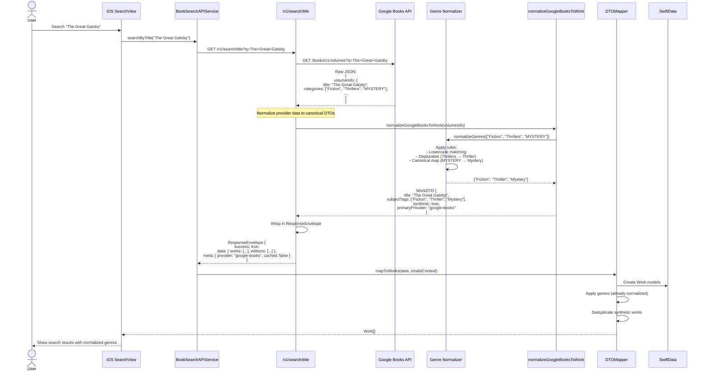
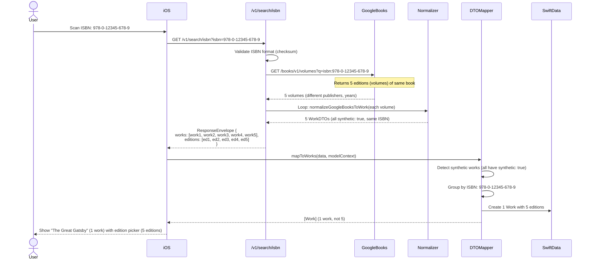
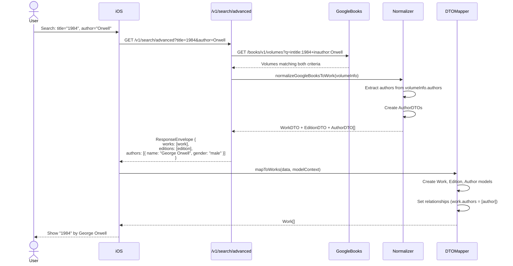
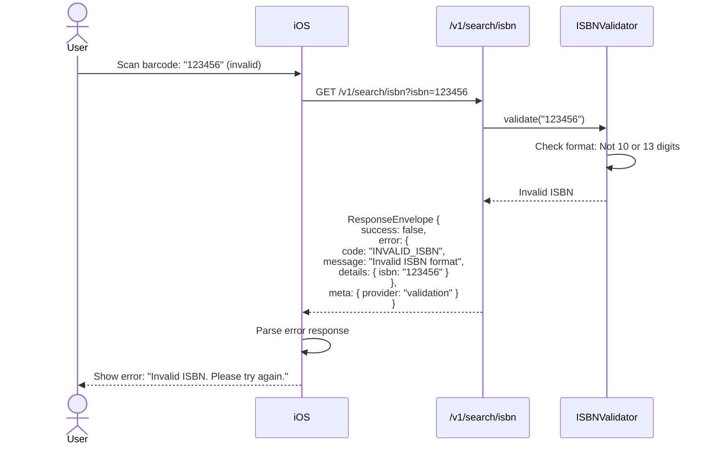
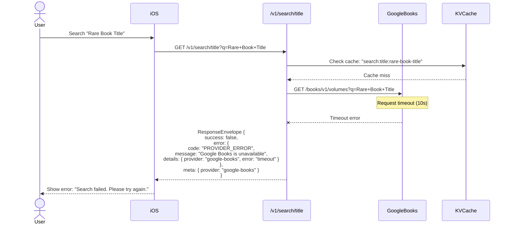
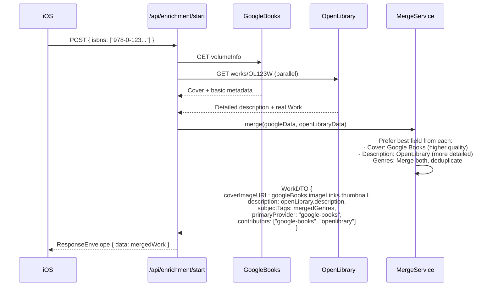
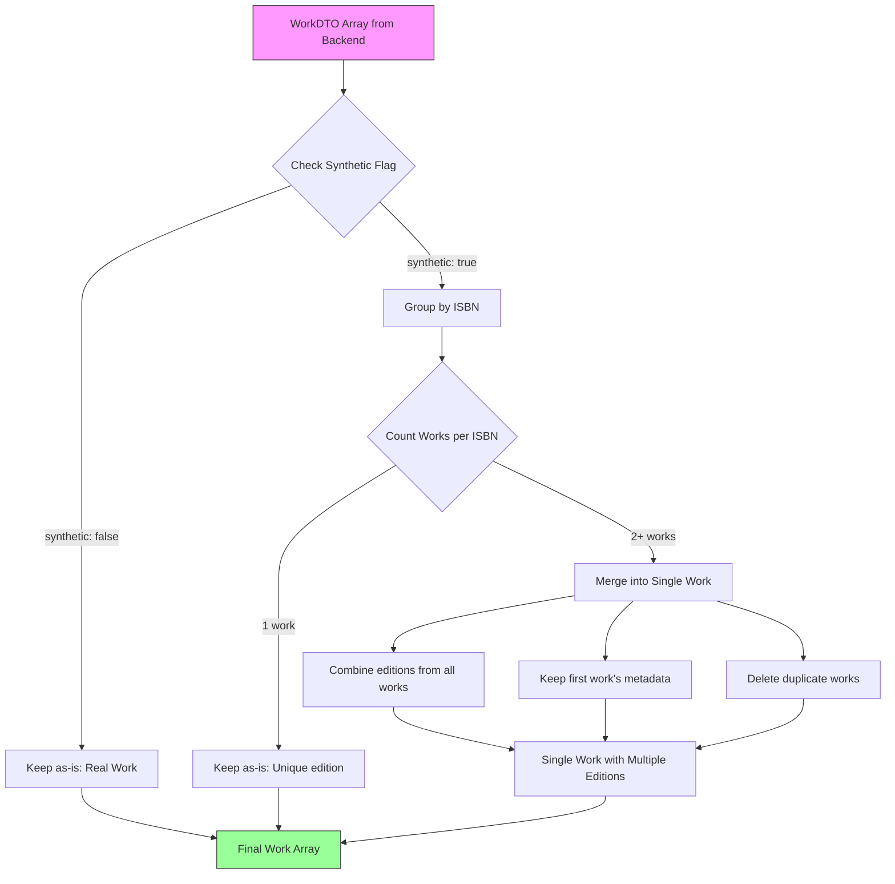
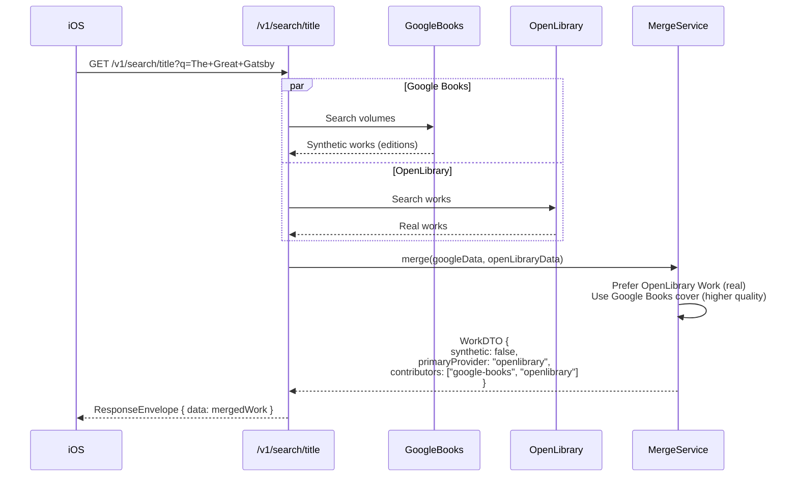

# Canonical Data Contracts Workflow

**Feature:** TypeScript-First API Contracts (v1.0.0)
**Last Updated:** October 31, 2025
**Related PRD:** [Canonical Data Contracts PRD](../product/Canonical-Data-Contracts-PRD.md)

---

## Overview

This workflow shows how backend normalizes provider-specific data into canonical DTOs and how iOS consumes them consistently, regardless of data provider.

---

## Happy Path: Title Search with Genre Normalization



**Key Points:**
- **Backend normalization:** Genres normalized BEFORE iOS receives data
- **Zero iOS logic:** DTOMapper applies genres directly (no normalization code)
- **Synthetic flag:** Google Books volumes marked `synthetic: true` for deduplication
- **Provenance:** `primaryProvider: "google-books"` tracks data source

---

## ISBN Search with Deduplication



**Key Points:**
- **Synthetic flag:** Signals iOS to deduplicate (group by ISBN)
- **Edition preservation:** All 5 editions preserved under single Work
- **User experience:** Library shows 1 book, edition picker shows 5 options

---

## Advanced Search (Title + Author)



**Key Points:**
- **Combined query:** Backend merges title + author filters
- **Author normalization:** AuthorDTO includes gender, cultural region (if available)
- **Relationships:** DTOMapper sets work ↔ author relationships

---

## Error Path: Invalid ISBN



**Key Points:**
- **Structured errors:** Error code (`INVALID_ISBN`) + message + details
- **User-friendly:** iOS translates error code to user message
- **No crash:** iOS handles error response gracefully

---

## Error Path: Provider Failure (Google Books Timeout)



**Key Points:**
- **Graceful degradation:** Timeout doesn't crash app
- **Error details:** Provider name + error type for debugging
- **Retry:** User can retry search (might succeed if Google Books recovers)

---

## Multi-Provider Enrichment (Legacy Reference)

> **Note:** This diagram references the deprecated `/api/enrichment/start` endpoint which has been removed. This section is kept for historical reference only.



**Key Points:**
- **Future enhancement:** Not yet implemented (October 2025)
- **Multi-provider:** Fetch from Google Books AND OpenLibrary
- **Best-of-breed:** Use best field from each provider
- **Provenance:** `contributors` lists all providers

---

## Genre Normalization Detail

```mermaid
flowchart TD
    A[Raw Genres from Provider] --> B{Normalize Each Genre}
    B --> C[Lowercase: "Thrillers" → "thrillers"]
    C --> D[Depluralize: "thrillers" → "thriller"]
    D --> E{Check Canonical Map}
    E -->|Found| F[Map to Canonical: "thriller" → "Thriller"]
    E -->|Not Found| G[Preserve Original: "Solarpunk" → "Solarpunk"]
    F --> H[Normalized Genres Array]
    G --> H
    H --> I[Return: ["Fiction", "Thriller", "Mystery"]]

    style A fill:#f9f,stroke:#333
    style H fill:#9f9,stroke:#333
    style I fill:#9f9,stroke:#333
```

**Canonical Genre Map (Sample):**
```typescript
const CANONICAL_GENRES = {
  'fiction': 'Fiction',
  'thriller': 'Thriller',
  'mystery': 'Mystery',
  'classics': 'Classic Literature',
  'science fiction': 'Science Fiction',
  'fantasy': 'Fantasy',
  // ... 30+ mappings
};
```

**Rules:**
1. Lowercase all genres
2. Depluralize (remove trailing 's')
3. Check canonical map
4. If found: Use canonical value
5. If not found: Preserve original (no data loss)

---

## Synthetic Work Deduplication Detail



**Example:**
- **Input:** 5 WorkDTOs (all synthetic, ISBN: 978-0-123...)
- **Process:** Group by ISBN → Detect 5 works with same ISBN
- **Output:** 1 Work with 5 editions (each edition from original WorkDTO)

---

## Performance Characteristics

### Timing Breakdown

| Phase | Duration | Notes |
|-------|----------|-------|
| iOS → Backend | 50-100ms | Network latency (CDN edge) |
| Backend → Google Books | 300-1000ms | Google Books API avg 500ms |
| Genre normalization | <5ms | Local TypeScript logic |
| DTO wrapping | <5ms | JSON serialization |
| Backend → iOS | 50-100ms | Network latency |
| iOS DTO parsing | 10-50ms | Swift Codable decoding |
| DTOMapper conversion | 20-100ms | SwiftData model creation |
| **Total (uncached)** | **500-1500ms** | Avg 800ms |
| **Total (cached)** | **50-150ms** | KV cache hit |

### Caching Strategy

**Endpoint:** `/v1/search/title`, `/v1/search/isbn`, `/v1/search/advanced`

**Cache Layers:**
1. **Cloudflare KV:**
   - Title search: 6 hours
   - ISBN search: 7 days
   - Advanced search: 6 hours
2. **Edge Cache:** 1 hour (Cloudflare CDN)
3. **iOS URLCache:** System-managed

**Cache Keys:**
```typescript
// Title search
`search:title:${query.toLowerCase().replace(/\s+/g, '-')}`

// ISBN search
`search:isbn:${isbn}`

// Advanced search
`search:advanced:${title}-${author}`
```

---

## DTO Field Mapping (TypeScript ↔ Swift)

### WorkDTO

| TypeScript Field | Swift Field | Type | Notes |
|------------------|-------------|------|-------|
| `title` | `title` | `String` | Required |
| `subjectTags` | `subjectTags` | `[String]` | Required (can be empty) |
| `synthetic` | `synthetic` | `Bool?` | Optional (default: false) |
| `primaryProvider` | `primaryProvider` | `String?` | Optional |
| `contributors` | `contributors` | `[String]?` | Optional |
| `googleBooksVolumeIDs` | `googleBooksVolumeIDs` | `[String]` | Required (can be empty) |

### EditionDTO

| TypeScript Field | Swift Field | Type | Notes |
|------------------|-------------|------|-------|
| `isbn` | `isbn` | `String?` | Optional (some editions lack ISBNs) |
| `isbns` | `isbns` | `[String]` | Required (can be empty) |
| `publisher` | `publisher` | `String?` | Optional |
| `coverImageURL` | `coverImageURL` | `String?` | Optional |
| `primaryProvider` | `primaryProvider` | `String?` | Optional |

### AuthorDTO

| TypeScript Field | Swift Field | Type | Notes |
|------------------|-------------|------|-------|
| `name` | `name` | `String` | Required |
| `gender` | `gender` | `DTOAuthorGender` | Required (enum) |
| `culturalRegion` | `culturalRegion` | `DTOCulturalRegion?` | Optional (enum) |

**Enum Sync:**
- TypeScript: `type AuthorGender = 'male' | 'female' | 'nonBinary' | 'other' | 'unknown'`
- Swift: `enum DTOAuthorGender: String, Codable { case male, female, nonBinary, other, unknown }`

---

## Integration Points

### Backend Services Using Canonical DTOs

**1. Search:**
- `/v1/search/title` - Title search
- `/v1/search/isbn` - ISBN lookup
- `/v1/search/advanced` - Multi-field search

**2. Bookshelf Scanner:**
- `/api/scan-bookshelf` - AI scanner uses `/v1/search/isbn` after detection

**3. CSV Import:**
- `/api/import/csv-gemini` - Uses `/v1/search/title` for metadata lookup

### iOS Services Consuming Canonical DTOs

**1. BookSearchAPIService:**
- Calls `/v1/search/*` endpoints
- Parses `ResponseEnvelope<SearchResponseData>`
- Passes to DTOMapper

**2. EnrichmentService:**
- Background enrichment calls `/v1/search/isbn`
- DTOMapper converts to SwiftData models

**3. BookshelfScannerService:**
- AI-detected ISBNs call `/v1/search/isbn`
- DTOMapper handles synthetic work deduplication

---

## Testing Scenarios

### Backend Test (Vitest)

**File:** `cloudflare-workers/api-worker/tests/handlers/v1/search-title.test.ts`

```typescript
test('V1 title search returns canonical DTOs', async () => {
  const response = await fetch('/v1/search/title?q=The+Great+Gatsby');
  const json = await response.json();

  expect(json.success).toBe(true);
  expect(json.data.works[0].title).toBe('The Great Gatsby');
  expect(json.data.works[0].subjectTags).toContain('Fiction');
  expect(json.data.works[0].synthetic).toBe(true);
  expect(json.data.works[0].primaryProvider).toBe('google-books');
  expect(json.meta.provider).toBe('google-books');
});
```

### iOS Test (Swift Testing)

**File:** `BooksTrackerPackage/Tests/BooksTrackerFeatureTests/CanonicalAPIResponseTests.swift`

```swift
@Test func parseWorkDTO() throws {
    let json = """
    {
      "title": "The Great Gatsby",
      "subjectTags": ["Fiction", "Classic Literature"],
      "synthetic": true,
      "primaryProvider": "google-books",
      "googleBooksVolumeIDs": [],
      "goodreadsWorkIDs": [],
      "amazonASINs": [],
      "librarythingIDs": [],
      "isbndbQuality": 0,
      "reviewStatus": "unreviewed"
    }
    """
    let dto = try JSONDecoder().decode(WorkDTO.self, from: json.data(using: .utf8)!)
    #expect(dto.title == "The Great Gatsby")
    #expect(dto.subjectTags == ["Fiction", "Classic Literature"])
    #expect(dto.synthetic == true)
}
```

---

## Future Workflow Enhancements

### OpenLibrary Provider Integration (Planned)



**Estimated Effort:** 3-4 days

---

## Conclusion

Canonical Data Contracts eliminate provider-specific logic in iOS, ensure genre consistency, and enable provenance tracking. Key benefits:

- ✅ **Zero iOS provider logic:** Single DTOMapper for all providers
- ✅ **Genre normalization:** Consistent genres (Fiction → Fiction, not fiction/FICTION)
- ✅ **Synthetic work deduplication:** 5 editions → 1 work in library
- ✅ **Provenance tracking:** Know which provider contributed data
- ✅ **Type safety:** TypeScript + Swift Codable catch errors at compile time

---

**Workflow Status:** ✅ Complete and Validated
**Last Tested:** October 31, 2025 (v1 endpoints production)
**Related PRD:** [Canonical Data Contracts PRD](../product/Canonical-Data-Contracts-PRD.md)
